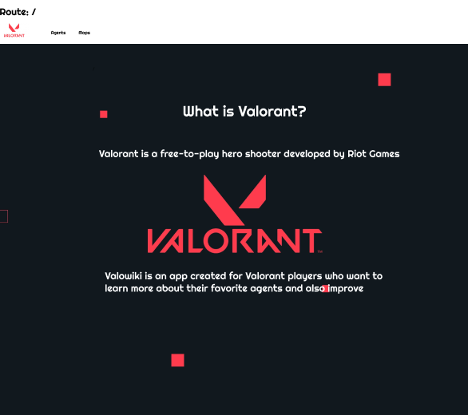
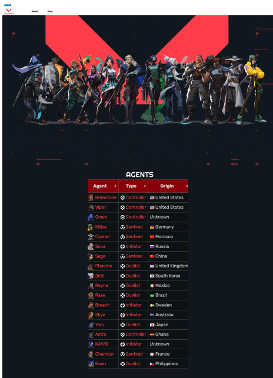
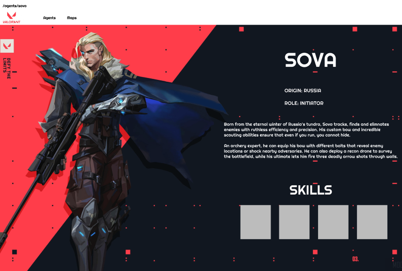
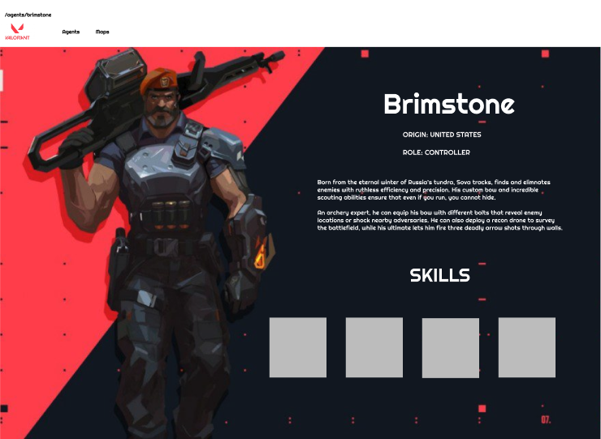
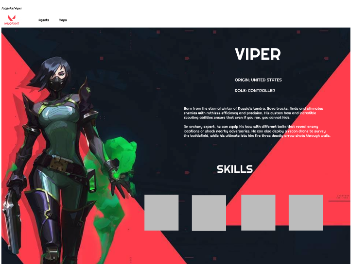
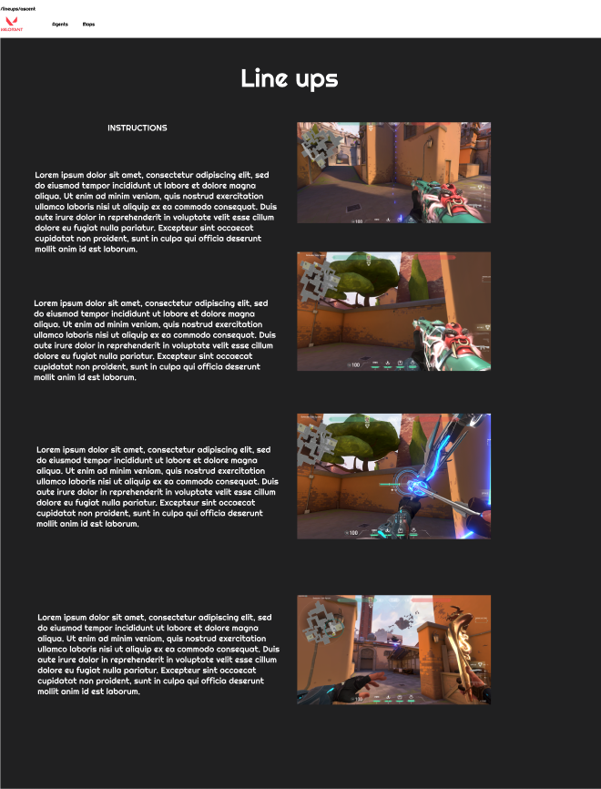

# Valowiki

An application that allows people to learn more in depth about their favorite Valorant agents while also becoming better players at the same time. The app showcases agents, maps, and some tips and tricks as well. 

## Deployment Link
- tbd

## Installation Instructions
- tbd

## Tech Used
* React
* Axios
* Figma
* Trello
* Tailwind CSS
* Javascript

## Routes
| **HTTP Verb**| **URL** |  **Action**| **Description**
|------------|-------------|------------|------------|
| GET        | /      | Index (read)  | Homepage
| GET         | agents       |  Show (read) |  List of all Agents
| GET     | agents/:id |  Show (read)    | Details pages for specific agent
| GET     | agents/:id/lineups | Show (read) | Display agent lineups
| GET     | maps/ | Show (read)    | List of all maps
| GET         | maps/:id      | Show (read) |  Details pages for specific maps
| GET | lineups/map:id | Show (read) | Details of lineups for specific maps

## Wireframes / Planning
---

    
Initial Planning

## MVP
- [] Homepage that shows a description of the game / app 
- [] Navbar that directs to agents + maps
- [] List of agents on agents page 
- [] Detailed information about certain agents on their specific page / gameplay hints
- [] Maps page showcasing different maps / hints

## Stretch Goals
- [] Details page for all Agents
- [] Details page for all maps
- [] Weapons skins tab that showcases all the various weapon skins

## Resourches
    
- [API](https://dash.valorant-api.com/)
