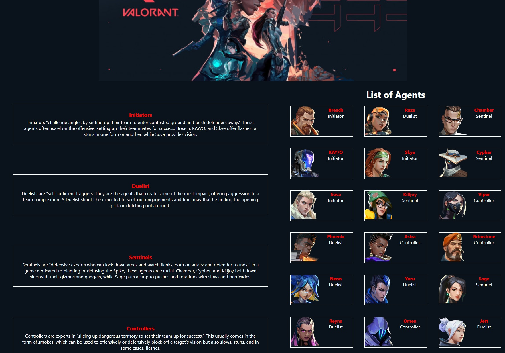

# Valowiki

An application that allows people to learn more in depth about their favorite Valorant agents while also becoming better players at the same time. The app showcases agents, maps, and some tips and tricks as well. 

## Deployment Link
[Valowiki](https://valowiki.herokuapp.com/)

## Installation Instructions
- Fork and clone the code and run `npm i` 
  <details>
    <summary> NPM </summary>

    - axios
    - react
    - react-dom
    - react-icons
    - react-player
    - react-router-dom

  </details>

## Planning Tools
* Figma
* Trello

## Tech Used
* React
* Axios
* CSS

## Routes
| **HTTP Verb**| **URL** |  **Action**| **Description**
|------------|-------------|------------|------------|
| GET        | /      | Index (read)  | Homepage
| GET         | /agents       |  Show (read) |  List of all Agents
| GET     | /agents/:id |  Show (read)    | Details pages for specific agent
| GET     | /lineups | Show (read) | Display agent lineups
| GET     | /maps | Show (read)    | List of all maps
| GET         | /maps/:id      | Show (read) |  Details pages for specific maps
| GET     | /weapons | Show (read)    | List of all weapons organized by category
| GET         | /weapons/:id      | Show (read) |  Detail page for a single weapon and showcase of skins

## Wireframes / Planning

<details>
    <summary>Initial Planning</summary>


</details>

## Final Design

<details>
    <summary>Screenshots</summary>





</details>

## MVP
- [X] Homepage that shows a description of the game / app 
- [X] Navbar that directs to agents + maps
- [X] List of agents on agents page 
- [X] Detailed information about certain agents on their specific page
- [X] Maps page showcasing different maps / callouts

## Stretch Goals
- [] Details page for all Agents
- [] Details page for all maps
- [X] Weapons skins tab that showcases all the various weapon skins

## Code Highlights
```javascript
export default function Weapons({ weapons }) {
   const categories = new Map()

   for (let index = 0; index < weapons.length; index++) {
      const oneWeapon = weapons[index]

      if (!categories.has(oneWeapon.category)) {
         categories.set(oneWeapon.category, [])
      }
      categories.get(oneWeapon.category).push(oneWeapon)
   }

   const weaponsList = []
   for (const arrayOfWeapons of categories.values()) {
      const displayName = arrayOfWeapons[0].shopData?.category || "Melee"
      weaponsList.push(<h2 className="center weapons-h2">{displayName}</h2>)

      const weaponsGroup = arrayOfWeapons.map((weapon, idx) => {
         return (
            <div key={`weapon-${idx}`}>
               <h3>{weapon.displayName}</h3>
               <p>
                  <br></br>
                  <Link to={`/weapons/${weapon.uuid}`}>
                     
                  </Link>
               </p>
            </div>
         )
      })
      weaponsList.push(<div className="weapons-container">{weaponsGroup}</div>)
   }

   return (
      <>
         <h1 className="center weapons-h1">List of Weapons</h1>
         <div className="center weapons-div">{weaponsList}</div>
      </>
   )
}
```

## Resources
    
- [API](https://dash.valorant-api.com/)
- Youtube
- Fontawesome
- Riot Games (All characters and assets belong to Riot Games)